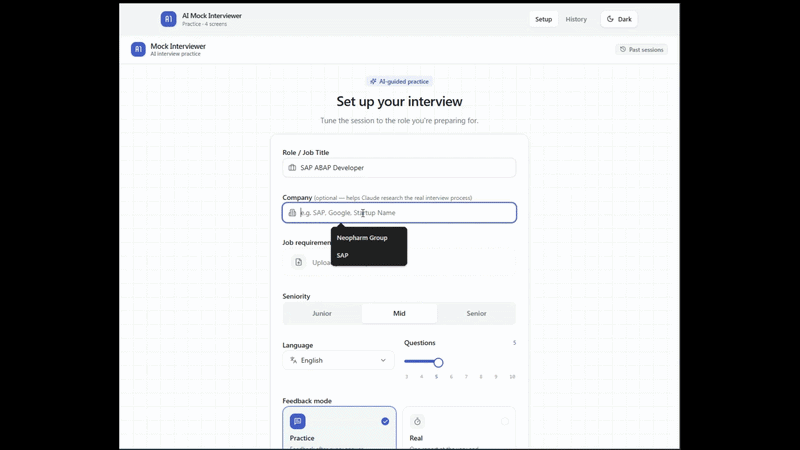

# AI Mock Interviewer

An AI-powered technical mock interview tool built with Claude. Configure a session for any role, answer questions in your browser, and get real-time scored feedback plus a final performance report.

## Demo



## Status

| Area | State |
|---|---|
| Interview flow (setup → questions → report) | Working |
| Per-answer evaluation with scoring | Working |
| PDF job-description upload | Working |
| English & German question/feedback generation | Working |
| History page | UI only — shows hardcoded mock data |
| Session persistence | **In-memory only** — sessions are lost on server restart |
| **Database** | **Not implemented — needed to make history work** |

### What's missing: database

Sessions live in a `Map` in [`apps/api/src/store.ts`](apps/api/src/store.ts). When the API restarts, all sessions are gone.

The History page ([`apps/web/src/pages/HistoryPage.tsx`](apps/web/src/pages/HistoryPage.tsx)) renders static mock data from [`apps/web/src/data/mockData.ts`](apps/web/src/data/mockData.ts) and is not connected to real sessions.

To fix: replace `store.ts` with a real database. Good options for this stack:
- **SQLite + Drizzle ORM** — local-first, no server needed, zero infra overhead
- **PostgreSQL + Drizzle ORM** — if multi-user or cloud deployment is planned

## Stack

**Monorepo — pnpm workspaces**

| Layer | Tech |
|---|---|
| Runtime | Node.js 22 (native TS, native fetch, native `--watch`) |
| API | Hono + Zod + `@anthropic-ai/sdk` |
| Frontend | React 19 + Vite + Tailwind CSS v4 + shadcn/ui |
| Server state | TanStack Query |
| AI | Claude (model configurable via env, defaults to `claude-sonnet-4-6`) |

## Prerequisites

- Node.js ≥ 20
- pnpm ≥ 9
- An [Anthropic API key](https://console.anthropic.com/)

## Setup

```bash
pnpm install

cp apps/api/.env.example apps/api/.env
# Edit apps/api/.env and set ANTHROPIC_API_KEY
```

## Running locally

```bash
# Start both API and frontend together
pnpm dev

# Or individually
pnpm dev:api   # → http://localhost:3000
pnpm dev:web   # → http://localhost:5173
```

## How it works

1. **Setup** — pick a role, optional company name, seniority (Junior / Mid / Senior), number of questions (3–10), feedback mode, and language. Optionally upload a job-requirements PDF.
2. **Generate** — the API calls Claude to produce targeted questions based on the company's known tech stack and the role's seniority level. If a PDF is uploaded it becomes the primary source for required skills.
3. **Interview** — answer each question. In **Practice mode** Claude evaluates every answer immediately: score 1–10, specific strengths, gaps, and a sample ideal answer. In **Real mode** answers are collected silently.
4. **Report** — Claude generates a final report: overall score out of 100, top strengths, improvement areas, and concrete study topics.

## Project layout

```
apps/
  api/
    src/
      index.ts                    # Hono server entry
      routes/sessions.ts          # All session endpoints
      services/ClaudeService.ts   # All Claude calls (questions, evaluation, report)
      store.ts                    # In-memory session store ← replace with DB
  web/
    src/
      pages/
        SetupPage.tsx
        InterviewPage.tsx
        ReportPage.tsx
        HistoryPage.tsx           # Needs real data from DB
      lib/api.ts                  # Typed Hono RPC client
packages/
  shared/                         # Zod schemas + inferred TypeScript types (shared by api and web)
```

## Environment variables

`apps/api/.env`:

```env
ANTHROPIC_API_KEY=sk-ant-api...
CLOUDE_MODEL_NAME=claude-sonnet-4-6   # optional
```
